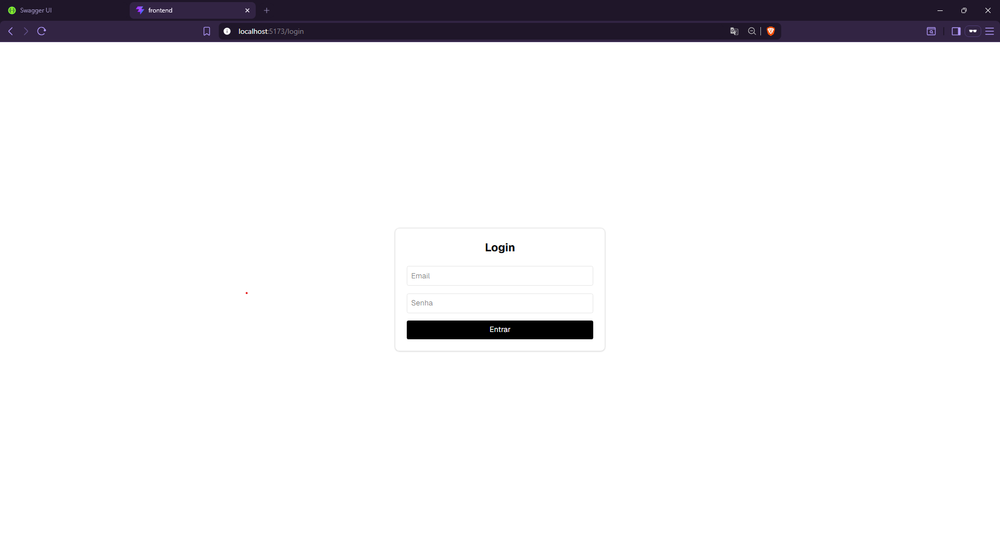
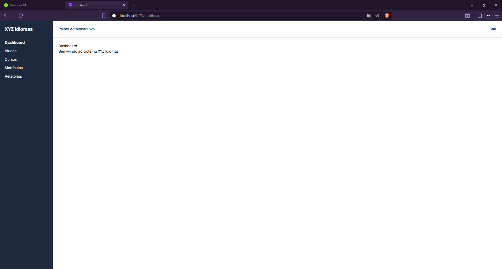
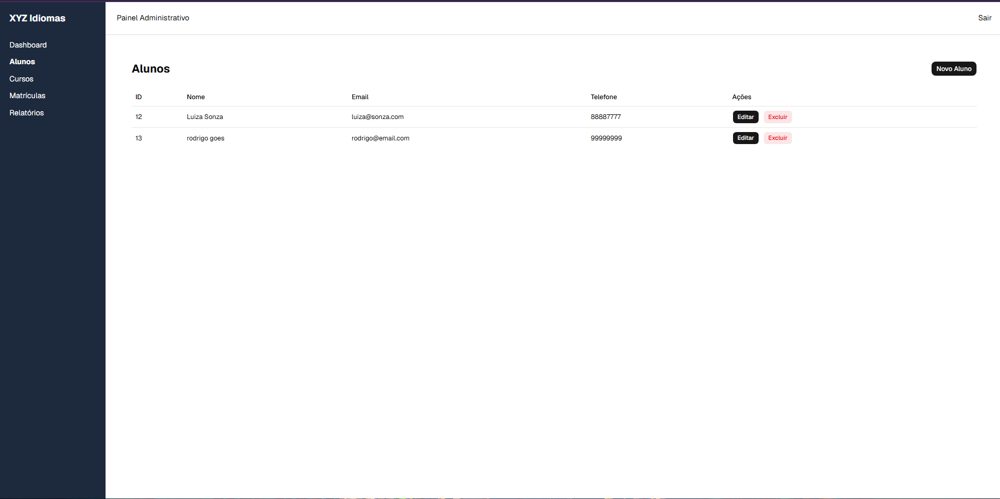
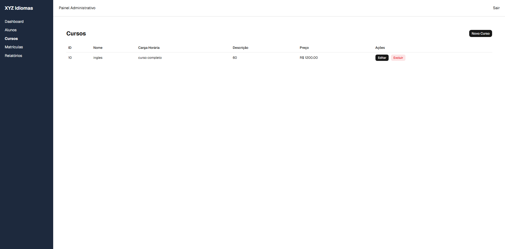
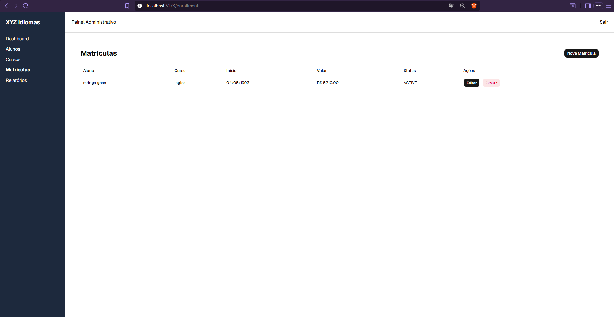
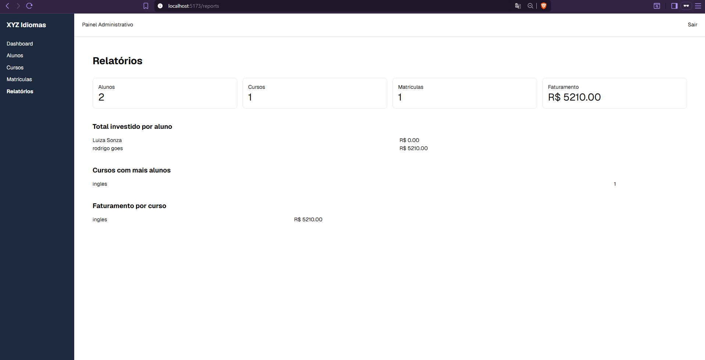
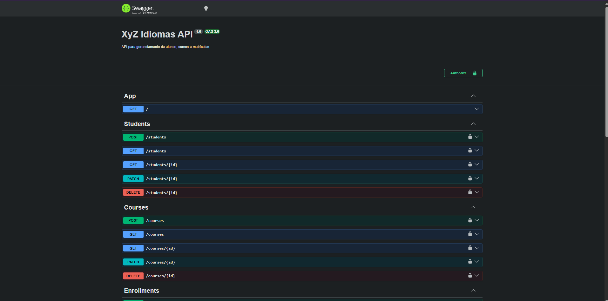

# 🎓 XYZ Idiomas

Sistema Full Stack para gerenciamento de alunos, cursos e matrículas, desenvolvido como teste técnico utilizando **NestJS**, **React**, **PostgreSQL** e **Docker**.

---

# 📖 Sobre o projeto

O sistema permite que administradores realizem o gerenciamento completo da escola fictícia **XYZ Idiomas**, incluindo:

- Login utilizando JWT
- Cadastro de alunos
- Cadastro de cursos
- Cadastro de matrículas
- Dashboard com indicadores
- Relatórios financeiros
- CRUD completo
- API documentada com Swagger

---

# 🚀 Tecnologias utilizadas

## Backend

- NestJS
- TypeScript
- Prisma ORM
- PostgreSQL
- JWT
- Passport
- Swagger
- class-validator
- Prisma Migrations
- Jest
- Pino Logger

## Frontend

- React 19
- Vite
- TypeScript
- React Router
- React Query
- Axios
- React Hook Form
- Zod
- TailwindCSS
- shadcn/ui

## DevOps

- Docker
- Docker Compose

---

# 📂 Estrutura do projeto

```
xyz-idiomas/

├── backend/
├── frontend/
├── docs/
└── README.md
```

---

# Funcionalidades

## 🔐 Autenticação

- Login utilizando JWT
- Rotas protegidas
- Persistência do token
- Logout

---

## 👨‍🎓 Alunos

- Listagem
- Cadastro
- Edição
- Exclusão

---

## 📚 Cursos

- Listagem
- Cadastro
- Edição
- Exclusão

---

## 📝 Matrículas

- Cadastro
- Edição
- Exclusão

Relacionando:

- Aluno
- Curso
- Status
- Data de início
- Valor pago

---

## 📊 Dashboard

Indicadores:

- Total de alunos
- Total de cursos
- Total de matrículas
- Faturamento total

---

## 📈 Relatórios

- Total investido por aluno
- Cursos com mais alunos
- Faturamento por curso

---

# Banco de Dados

Entidades principais:

```
User
Student
Course
Enrollment
```

Relacionamentos:

```
Student
    │
    └──────── Enrollment ───────── Course
```

---

# Backend

## Recursos implementados

- JWT Authentication
- Guards
- DTO Validation
- Exception Filter
- Swagger
- Prisma ORM
- Migrations
- Seed
- Transactions
- Logging estruturado
- Testes automatizados com Jest

---

# Frontend

## Recursos implementados

- React Query
- Axios
- React Hook Form
- Layout Responsivo
- CRUD completo
- Dialogs (shadcn/ui)
- Componentização
- Consumo da API REST

---

# Como executar localmente

## 1. Clone o repositório

```bash
git clone https://github.com/Oblizion/xyz-idiomas.git

cd xyz-idiomas
```

---

# Configuração

Entre na pasta do backend:

```bash
cd backend
```

Copie os arquivos de configuração:

### Linux / macOS

```bash
cp .env.example .env
cp .env.docker.example .env.docker
```

### Windows (PowerShell)

```powershell
Copy-Item .env.example .env
Copy-Item .env.docker.example .env.docker
```

Os arquivos de exemplo já possuem uma configuração padrão para execução local e com Docker.

Caso deseje utilizar outras credenciais ou portas, basta editar os arquivos após a cópia.

---

# Executando o Backend

Instale as dependências:

```bash
npm install
```

Execute as migrations:

```bash
npx prisma migrate deploy
```

Popule o banco:

```bash
npx prisma db seed
```

Inicie a aplicação:

```bash
npm run start:dev
```

---

# Executando o Frontend

Entre na pasta:

```bash
cd frontend
```

Instale as dependências:

```bash
npm install
```

Execute:

```bash
npm run dev
```

---

# Executando com Docker

Na pasta **backend** execute:

```bash
docker compose up --build
```

O container executa automaticamente:

- Migrations
- Prisma Generate
- Seed
- Inicialização da aplicação

Caso deseje recriar os dados posteriormente:

```bash
docker exec -it xyz_backend npx prisma db seed
```

---

# Login

Administrador criado automaticamente pela Seed.

Email

```
admin@xyz.com
```

Senha

```
123456
```

---

# Swagger

Disponível em:

```
http://localhost:3000/api
```

---

# Testes

Backend

```bash
npm test
```

Cobertura de testes

```bash
npm run test:cov
```

---

# Linting e Formatação

O projeto utiliza ferramentas para manter a qualidade e padronização do código.

### ESLint

Análise estática do código.

```bash
npm run lint
```

### Prettier

Formatação automática do código.

```bash
npm run format
```

---

# Screenshots

## Login



---

## Dashboard



---

## Alunos



---

## Cursos



---

## Matrículas



---

## Relatórios



---

## Swagger



---

# Diferenciais implementados

- JWT Authentication
- Guards
- Prisma ORM
- Docker
- Docker Compose
- Swagger/OpenAPI
- React Query
- TailwindCSS
- shadcn/ui
- DTO Validation
- Global Exception Filter
- Logging estruturado (Pino)
- Migrations
- Seed
- Transações com Prisma
- Testes automatizados com Jest
- Interface responsiva

---

# Autor

**Luan Martins Rodrigues Ananias**

Desenvolvido como teste técnico para a **MM Tecnologia da Informação LTDA**.